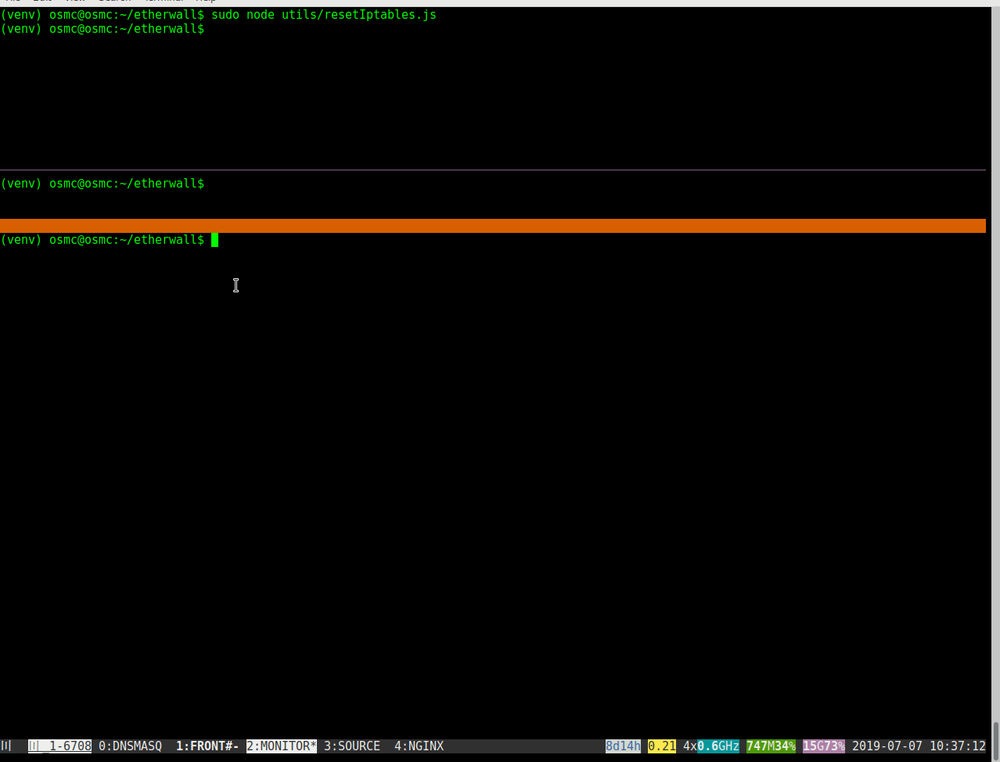

# etherwall
Back-end to control network ip packet forwarding in order
to allow ISP customers to share their internet connection
using WiFi depending on end users performing token/ethereum payment
transactions.

## Development status demo 1

Currently, we already have a NodeJS backend together with Nginx that configures
iptables in order to act as a captive portal using the
[generate_204](https://www.chromium.org/chromium-os/chromiumos-design-docs/network-portal-detection)
endpoint to trigger captive portal frontend loading on Android devices.



Right now, we still have to begin implementing the frontend in order to perform the payment
transactions using [MetaMask](https://metamask.io) plugin; so the back end accepts unconditionally
any time requests for demo purposes.

## Main workflow steps prevision

### End user connects to an open WiFi

WiFI hostpot using hostapd on a Raspberry Pi using Raspbian or OSMC system (see [doc/SETUP.md](doc/SETUP.md)).
Please notice that this is the weakest step from security point of view; since you are allowing users
to connect to your wireless network and in case you have services apart from the captive portal
unprotected, they can be susceptible to attacks; for example, in particular you should ensure you change the
default osmc/osmc pi/raspberry password schemas in order to prevent an attacker to take control
of your system.

### DHCP servce

User device gets an ip address from dnsmasq running in the
Raspberry Pi (see [doc/SETUP.md](doc/SETUP.md)).

### Captive portal detection

Customer device tries to get /generate_204 and obtains a redirect
to the captive portal frontend (still on progress).

### MetaMask plugin

Customer uses MetaMask plugin to interact with the frontend
to sign a payment transaction of ethereums or smart contract
tokens for some service time duration. When the backend is executed,
one of the first thing it does is to allow all kinds of traffic to
[Infura's RPC API](https://infura.io)
hosts in order to allow the user to reach a relayer although does not have
broad internet connectivity.

### Frontend notifies backend about the relayed transaction

Frontend sends the time duration of the service and the transaction hash
in order to allow the backend to check for correctness and confirmation
using again Infura's RPC API; in case everything is fine, sets up on iptables
the rules needed to forward and retrieve user's traffic based on device's MAC address.

## Initial setup

You can find initial setup instructions [here](doc/SETUP.md).

## Installing dependencies locally

Using nodeenv-1.3.3 in order to avoid polluting the host NodeJS system:

```
$ sudo apt-get install python-pip
$ sudo pip install nodeenv
$ nodeenv --node 10.15.1 venv
$ source venv/bin/activate
(venv) $ npm install
```

## Configuration

File .env.sample contains sample configuration; copy it to .env and edit
its values to match your configuration:

- PORTAL_IP=192.168.4.1 (depending on your final setup)
- DEVICE_TEST_IP=192.168.4.101 (in order to test a particular device if DEVELOPMENT is set to true)
- DEVELOPMENT=false
- INFURA=rinkeby.infura.io (Infura Domain Name)
- PORT=3001 (API port)

## Running the server

Execute inside virtual environment shell:

```
(venv) $ sudo node main.js
```

Notice that since the API reads and modifies iptables, this backend
should be executed with superuser privileges.

## Nginx configuration

In order to serve the API through 80 port:

```
server {
       listen 80 default_server;
       listen [::]:80 default_server;
       server_name _;

       location / {
                proxy_pass http://127.0.0.1:3001/;
                proxy_http_version 1.1;
        }
}
```

## Endpoints & methods

### GET http://192.168.4.1

For testing purposes:

```
$ curl -XGET http://192.168.4.1/
```

Response:

```
{"ipAddress":"192.168.4.18","mac":"00:73:ac:a3:21:b1"}
```

Containing your ip address and your mac; mac is obtained using
[node-arp](https://www.npmjs.com/package/node-arp).

### POST http://192.168.4.1/mac

Example:

```
curl -H 'Content-Type: application/json' -XPOST http://192.168.1.36/mac --data '{"timeLeft": 3600, "txId": e472b7 ... 39cead9"}'
```

This check transaction correctness and confirmation and after that, configure
the firewall in order to grant access to the internet during timeLeft.

## Utilities

### Reset iptables

```
(venv) $ sudo node utils/resetIptables.js
```

### iptables monitor

```
(venv) $ sudo node utils/monitor.js
```
